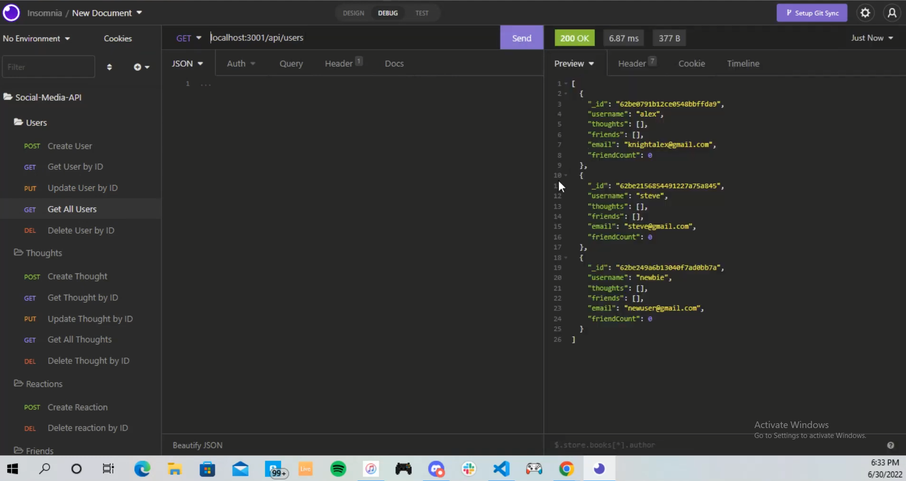

# Social-Media-API

## Description
This application is a backend API for a social networking app. Users can share thoughts, react to other thoughts, and add friends. This is merely the backend so testing routes in insomnia is the best way to see that everything is working correctly.

Click the image below to view a walkthrough video: 

## Installation
First initialize node package manager with `npm init`
Next install all dependencies with `npm install`

## Usage 
To run the application navigate to the root of the project directory in the terminal.
Enter `npm start` to run server. 

## Questions

contact me here with any questions: [email](mailto:knightalex17@gmail.com), [GitHub](https://github.com/alknight17)